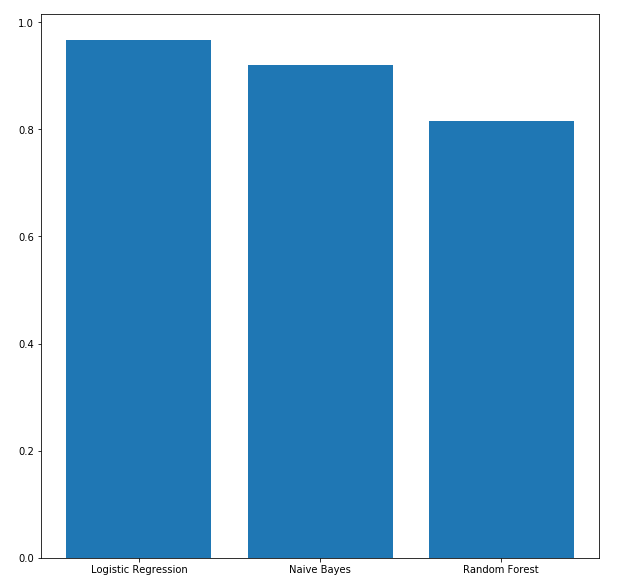

## Spam Detection

The dataset includes tagged SMS messages. It contains 5,574 English SMS messages in total; tagged as ham or spam. Check the SMSSpamCollection dataset for details.

• MLlib with PySpark is used to build the model.  
• Preprocessing steps are performed and feature engineering is applied using TF-IDF. 
• Logistic regression, Random Forest and Naive Bayes are used for classifications. 
• The best performance is achieved for the Logistic regression with 97% accuracy. 
 
## Performance of different algorithms (i.e., Churn):

